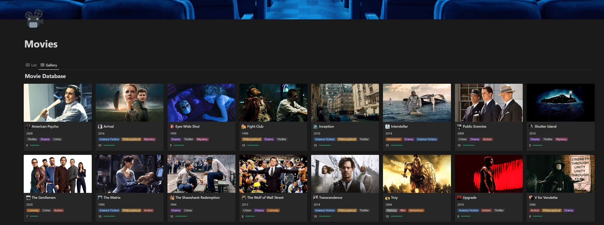
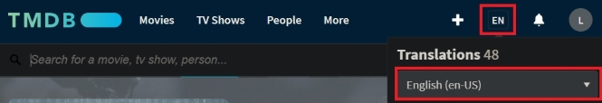
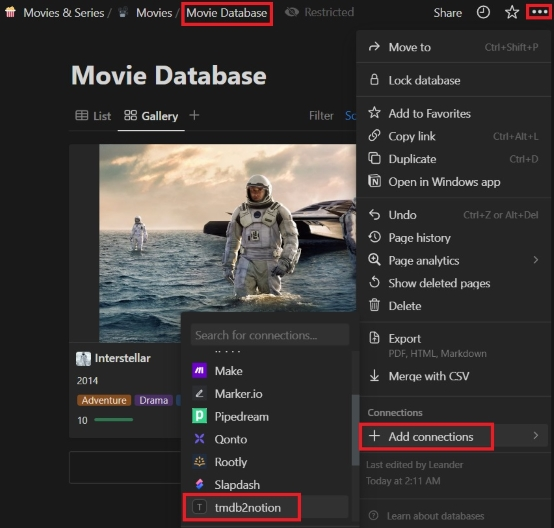
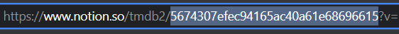
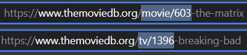
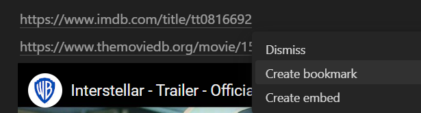
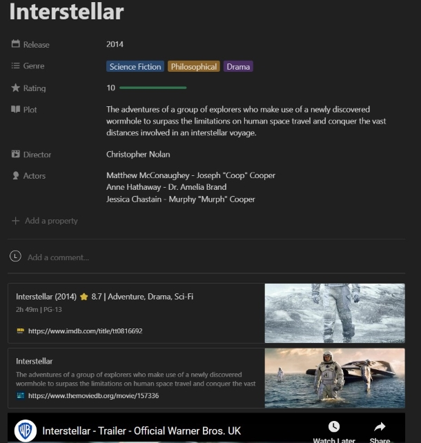

# tmdb2notion
A small Python script that allows you to import your favorite movies, series or anime from the Movie Database ([TMDB](https://www.themoviedb.org)) directly into your [Notion.so](https://www.notion.so/) database.
#


### How to use

1. You need to create an account on TMDB to register for an [API key](https://developer.themoviedb.org/docs/getting-started).
2. Create a "[New integration](https://www.notion.so/my-integrations)" on Notion and name it "tmdb2notion" for example.
3. Add your `tmdb_access_token_auth`, your `notion_integration_secret`,  
   and your `language_param` to the [config.ini](config.ini) file.

   
4. Now duplicate my Notion "🍿Movies & Series" [Template](https://tmdb2.notion.site/Movies-Series-c6c7c495a4604a7d801cc8542adbb8fd?pvs=4)
5. Connect **each** database (Movie, Series and Anime) with your "tmdb2notion" integration. ([Notion Guide: Step 2](https://developers.notion.com/docs/create-a-notion-integration))
    - Click the ••• on the top right corner of the page.
    - Scroll to the bottom of the pop-up and click Add connections.
    - Search for "tmdb2notion" and select it in the Search for connections... menu.
    - Repeat for each database
  
   
6. Make sure you have the correct database id's for Movie, Series and Anime  
   in the [database.ini](database.ini) file. ([Notion Guide: Step 3](https://developers.notion.com/docs/create-a-notion-integration))

   

7. If everything is set up correctly, you can now run the Python script. Pick your [movie](https://www.themoviedb.org/movie/603-the-matrix), [series](https://www.themoviedb.org/tv/1396-breaking-bad) or [anime](https://www.themoviedb.org/tv/37854) on TMDB  
   and copy only the type and id into "Please insert the TMDB-ID here:".

   

   ```
   Terminal:
   
   Please insert the TMDB-ID here: movie/603
   1 - movie
   2 - tv
   3 - anime
   Select your notion database_id with the corresponding number: 1
   Selected notion database_id: movie -> 5674307efec94165ac40a61e68696615
   200
   The Matrix
   ```

#
### Workaround

Unfortunately, the Notion API currently has a small bug with bookmarks. Other than adding them manually, these bookmarks are always delivered without a preview. 
To avoid this issue, I made a temporary adjustment by removing bookmarks from my payload and sending only the rich text link instead.
However, there is a quick manual workaround to still get our bookmarks with a preview.

1. Highlight the link text.
2. Cut it.
3. Immediately paste it back.
4. Finally, choose the "Create Bookmark" option.




